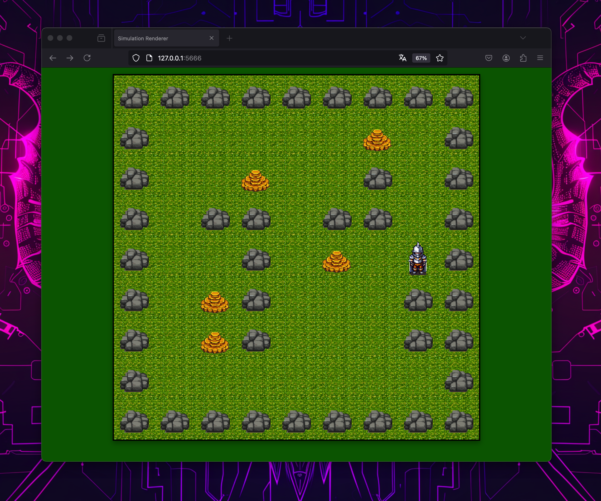

# The Grid - Autonomous LLM-Powered Agents



It is becoming clearer every day, that one of the most promising use cases of LLMs is their use as reasoning engines in autonomous agents.

This repository is the outcome of a learning exercise. It shows how to set up a simple grid world simulation as a server and connect an agent to it. The agent perceives the environment, forms and maintains memory, and acts based on what it knows. The exemplary agent, who is stupid as a bag of nails, while writing this README, reasons using and LLM. It is configured to use a local LLM, but any LLM that is exposed via an OpenAI compatible AI can be used.

## Credit where credit is due

- This work is sponsored by [KI Salon](https://www.ki-salon.net/) and [42 Heilbronn](https://www.42heilbronn.de/). I worked there as AI artist in residence in 2023 and now as an advisor.
- This work is heavily inspired by the [Multi-Agent Programming Contest](https://multiagentcontest.org/). This was part of my doctoral research. I implemented the simulation in Python from scratch over a few hours.
- Most of the assets were generated by [Retro Diffusion](https://www.retrodiffusion.ai/) and [Aseprite](https://www.aseprite.org/), Generative AI for pixelart. Cool work!
- [Generative Agents](https://github.com/joonspk-research/generative_agents) is a fine use case for LLM-powered multi-agent social simulations. You should have a close look.

## Running

In order to run LLMs locally it is suggested to run LLM via Ollama. Install following the instructions: https://ollama.com/

Currently the LLM-agent is configured to use Gemma 2. Please install it like this:

```
ollama pull gemma2:27b
```

Note that it is not obligatory to use this model. It is just one example.

### Simulation

After setting up, the next step would be running the server. Do this:

```
cd simulation
python run.py
```

You can then watch the simulation at [http://127.0.0.1:5666](http://127.0.0.1:5666).

Note that if no agent is connected, nothing will happen.

### Agent

Once the simulation is running, start the agent as another process:

```
cd agents
python run.py
```

If all is good, you should see the agent acting in the grid world.

### Human

As an alternative and for testing you can run a human agent like this:

```
cd agents
python runhuman.py
```

You can use the arrow keys to move, P to pickup and D to drop.

## Extending

If you want to come up with a smarter agent, start with `agents/source/llmagent.py`. This is a simple agent that uses an LLM for reasoning. The whole reasoning cycle is implemented in [LangChain](https://www.langchain.com/)/[LangGraph](https://langchain-ai.github.io/langgraph/). I do not believe that changing the hard-wired LLM to another one would do the trick. Instead I believe that chaning the cycle and the prompts would yield good results.

